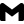
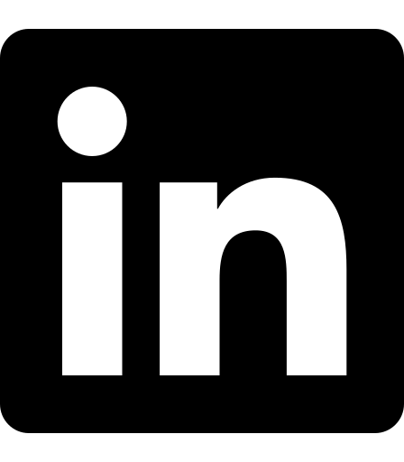

<!--# Hey there! :wave: I'm Emanuele.-->

I'm Emanuele! :wave:  

- M.Sc. in **Computer Engineering** at [UniBg](https://en.unibg.it/) :it:
- Abroad studies at [TalTech](https://taltech.ee/en) :estonia: and [SDU](https://www.sdu.dk/en) :denmark:

### :speech_balloon: Get in touch

[<picture><source media="(prefers-color-scheme: dark)" srcset="./assets/svg/globe_dark.svg"></picture>][website]

[<picture><source media="(prefers-color-scheme: dark)" srcset="./assets/svg/gmail_dark.svg"></picture>][email]

[<picture><source media="(prefers-color-scheme: dark)" srcset="./assets/svg/linkedin_dark.svg"></picture>][linkedin]

 

<!-- Or scan below: 

 -->

### :books: Looking for my resume? E-mail me!

### :chart_with_upwards_trend: Stats

<!--  -->

---

[][github] 
[][website]

[email]: https://formsubmit.co/el/voteva
[github]: https://github.com/mnau23
[linkedin]: https://www.linkedin.com/in/emanueleperico
[website]: https://emanuele.codes/

<!--
**mnau23/mnau23** is a ✨ _special_ ✨ repository because its `README.md` (this file) appears on your GitHub profile.
Here are some ideas to get you started:
- 🔭 I’m currently working on ...
- 🌱 I’m currently learning ...
- 👯 I’m looking to collaborate on ...
- 🤔 I’m looking for help with ...
- 💬 Ask me about ...
- 📫 How to reach me: ...
- 😄 Pronouns: ...
- ⚡ Fun fact: ...
-->
